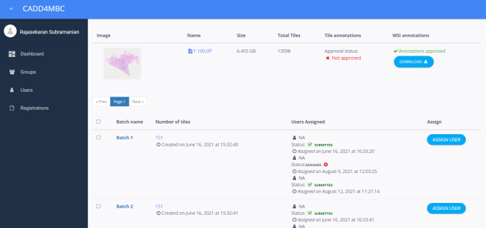
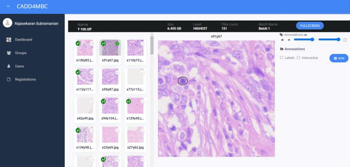
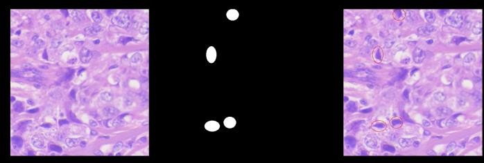
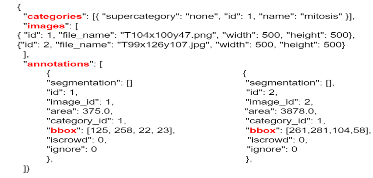
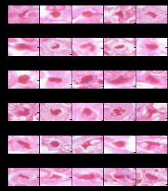
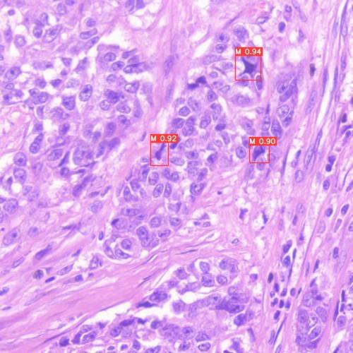
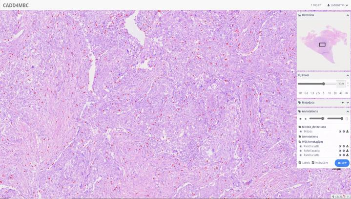

# 🔬 Breast Cancer Mitosis Detection on Whole Slide Images

> **Published Paper:** [Web based Mitosis Detection on Breast Cancer Whole Slide Images using Faster R-CNN and YOLOv5](https://dx.doi.org/10.14569/IJACSA.2022.0131268)  
> *International Journal of Advanced Computer Science and Applications (IJACSA), Vol. 13, No. 12, 2022*  
> Rajasekaran Subramanian, R. Devika Rubi, Rohit Tapadia, Katakam Karthik, Mohammad Faseeh Ahmed, Allam Manudeep

---

## Overview

Mitotic count is a core component of the **Nottingham Grading System** for breast cancer classification. Manual counting under a microscope is slow, semi-quantitative, and prone to inter-observer variability. This project automates mitosis detection on WSIs using **Faster R-CNN** and **YOLOv5**, trained on 56,258 annotated tiles, achieving an **F1 score of 84%**.

The system is integrated into **CADD4MBC** — a web-based platform for WSI upload, annotation, and diagnostic visualization.

---

## Workflow

```
WSI (.tiff)
    │
    ▼
[1. Tile Extraction]
    Break WSI into tiles (500×500 px), named {x}_{y}.png
    │
    ▼
[2. Annotation via CADD4MBC]
    Pathologists annotate mitotic figures tile by tile
    Annotations exported as JSON files
    │
    ▼
[3. Mask Generation]  ◄── MaskGenerator-Copy1.ipynb
    Generate binary masks from JSON polygon annotations
    │
    ▼
[4. Dataset Pipeline]  ◄── Pipeline_notebook_for_preparing_dataset-video-final.ipynb
    Organize tiles + masks across slides (T98, T120, T121, ...)
    Convert annotations to COCO format (Faster R-CNN) / .txt format (YOLOv5)
    │
    ▼
[5. Training]  ◄── Mitosis_Final.ipynb / KmitMitosDetectron-KmitData_test.ipynb
    Train Faster R-CNN X-101-FPN and YOLOv5 on annotated tiles
    Evaluate on KMIT, MITOS-12, MITOS-14, TUPAC datasets
    │
    ▼
[6. Inference & Visualization on CADD4MBC]
    Run predictions tile-by-tile across the full WSI
    View detections overlaid on slide in the browser
```

---

## Project Structure

```
MitosisDetection/
├── Images/
│   ├── Fig1_CADD4MBC_WSI_Batches.png
│   ├── Fig2_CADD4MBC_Mitosis_Annotation.png
│   ├── Fig3_Generated_Mask_and_Annotations.png
│   ├── Fig4_COCO_Format_Annotation.png
│   ├── Fig5_Single_Mitosis_Detection_FasterRCNN.png
│   ├── Fig6_Mitosis_Detection_on_Tiles_FasterRCNN.png
│   └── Fig7_Mitosis_Detection_YOLOv5_WSI.png
│
├── MaskGenerator-Copy1.ipynb                                    # JSON annotation → binary mask generation
├── Pipeline_notebook_for_preparing_dataset-video-final.ipynb    # Dataset prep & COCO format conversion
├── Mitosis_Final.ipynb                                          # Main training & evaluation notebook
├── KmitMitosDetectron-KmitData_test.ipynb                       # Testing on KMIT institutional dataset
│
└── Dataset/
    ├── cadd_json_files/<slide_id>/<batch>/<x>_<y>.json          # Per-tile CADD4MBC annotations
    ├── filtered_images/<slide_id>/                              # Extracted WSI tiles (.jpg / .png)
    ├── filtered_image_masks/<slide_id>/                         # Generated binary masks
    └── json_list/<slide_id>_json.txt                            # Index of annotated tile filenames
```

---

## Dataset

### KMIT Private Dataset

75 breast cancer WSIs collected from Basavatarakam Indo-American Hospital and scanned by Tapadia Diagnostics Centre at 40× magnification. Each WSI is divided into batches of tiles for pathologist annotation via CADD4MBC.


*Fig. 1 — Uploaded WSI and tile batches in the CADD4MBC platform*

Each tile is annotated directly by pathologists in the CADD4MBC viewer:


*Fig. 2 — Pathologist annotating mitotic figures on tiles*

| Dataset | Size | Image Size | Tiles after Augmentation | Annotation |
|---|---|---|---|---|
| ICPR 12 | 2,994 | 512×512 | 4,367 | Strongly labelled (CSV) |
| ICPR 14 | 2,400 | 512×512 | — | Weakly labelled (CSV) |
| TUPAC | 2,650 | 512×512 | — | Weakly labelled (CSV) |
| **KMIT Dataset** | **42,000** | **512×512** | **56,258** | **Strongly labelled (JSON)** |

---

## Preprocessing

### Mask Generation

Annotation JSONs from CADD4MBC are used to generate binary ellipse masks using OpenCV. Annotations with very small ellipse areas are discarded to avoid noisy training samples.


*Fig. 3 — Original image (left), generated binary mask (center), ground truth annotations (right)*

### Annotation Format Conversion

- **Faster R-CNN** → COCO JSON format (single combined file for all annotations)
- **YOLOv5** → `.txt` format with `[class, x-center, y-center, width, height]` per line


*Fig. 4 — Sample COCO format annotation for mitotic figures*

---

## Models

### Faster R-CNN
Uses a **ResNeXt-101-32x8d + FPN** backbone pretrained on COCO. Three components:
- **Backbone (ResNet-FPN):** Extracts multi-scale feature maps with skip connections to prevent gradient vanishing
- **Region Proposal Network (RPN):** Generates and classifies anchor boxes for candidate mitosis regions
- **ROI Pooling:** Converts variable-size proposals to fixed-size feature maps for the classifier

### YOLOv5
Single-stage detector requiring one forward pass. Uses:
- **CSPNet** backbone for feature extraction
- **PANnet** neck for multi-scale feature pyramids
- **YOLO head** generating 3 feature map sizes (18×18, 36×36, 72×72) to handle mitoses of varying sizes

---

## Training

```bash
jupyter notebook Mitosis_Final.ipynb
```

**Key configuration:**

| Parameter | Value |
|---|---|
| Backbone | ResNeXt-101-32x8d + FPN |
| Pretrained weights | COCO model zoo |
| LR Scheduler | WarmupMultiStepLR |
| Warmup iterations | 1,000 |
| Max iterations | 5,000 |
| Base LR | 0.001 |
| Training tiles | 45,006 |
| Testing tiles | 11,251 |

---

## Results


*Fig. 5 — Individual mitotic cell detections with confidence scores*


*Fig. 6 — Faster R-CNN bounding box predictions on a WSI tile*


*Fig. 7 — YOLOv5 mitosis detections (red dots) visualized across the full WSI in CADD4MBC*

### Performance Summary

| Dataset | Training | Testing | Model | F1 | Recall | Precision | Training Time |
|---|---|---|---|---|---|---|---|
| ICPR12 | 3,304 | 1,063 | Faster R-CNN | 85.48 | 88.91 | 82.15 | 49 mins |
| ICPR14 | — | 547 | Faster R-CNN | 81.46 | 87.89 | 76.52 | — |
| TUPAC | — | 321 | Faster R-CNN | 82.15 | 81.56 | 81.69 | — |
| KMIT | 45,006 | 11,251 | Faster R-CNN | 75.86 | 73.83 | 76.86 | 10h 46m |
| KMIT | 45,006 | 11,251 | YOLOv5 (CPU) | 84.23 | 81.62 | 86.76 | 9h 12m |
| KMIT | 45,006 | 11,251 | YOLOv5 (Distributed GPU) | **84.58** | 82.31 | 86.42 | **5h 28m** |

---

## Setup

### Requirements

```bash
pip install torch torchvision
pip install detectron2 -f https://dl.fbaipublicfiles.com/detectron2/wheels/cu102/torch1.10/index.html
pip install opencv-python pillow numpy matplotlib tqdm pycocotools
```

> GPU required. Tested with PyTorch 1.10, CUDA 10.2, Detectron2.

---

## Citation

If you use this work, please cite:

```bibtex
@article{Subramanian2022,
  title   = {Web based Mitosis Detection on Breast Cancer Whole Slide Images using Faster R-CNN and YOLOv5},
  journal = {International Journal of Advanced Computer Science and Applications},
  doi     = {10.14569/IJACSA.2022.0131268},
  url     = {http://dx.doi.org/10.14569/IJACSA.2022.0131268},
  year    = {2022},
  volume  = {13},
  number  = {12},
  author  = {Rajasekaran Subramanian and R. Devika Rubi and Rohit Tapadia and
             Katakam Karthik and Mohammad Faseeh Ahmed and Allam Manudeep}
}
```

---

## References

- [Faster R-CNN — Ren et al., 2015](https://arxiv.org/abs/1506.01497)
- [Detectron2 — Facebook AI Research](https://github.com/facebookresearch/detectron2)
- [YOLOv5 — Ultralytics](https://github.com/ultralytics/yolov5)
- [MITOS-12 / MITOS-14 Benchmarks](http://ludo17.free.fr/mitos_2012/)
- Nottingham Histologic Grading System for breast cancer

---

## License

MIT License.
